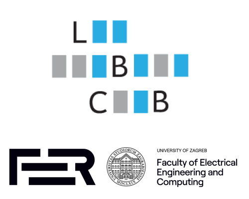

# Mapping third-generation sequencing data to a reference genome

  

New advances in genome sequencing technologies have increased the usability of obtained fragments due to the manifold increase of their length. The only drawback is the decreased accuracy, but the continuous improvements will eventually reach error levels that are negligible. Finding the origin and per nucleotide relationship of a sequenced read and a reference genome has various vital use cases in bioinformatics, and is usually based on heuristic short substring matching followed by exact alignment via dynamic programming. The combination of increased length and error rate led to development of new algorithms, one of which will be presented and implemented during this course.

The main goal of this course is for participants to individually code the whole project in several steps, get familiar with C++, basics of compilation methods, version control, unit tests and continuous integration. At the end of the course, each participant will have implemented couple of standalone libraries that enable placement and similarity description between a large amount of substrings of various sizes, and a much longer string from which they all originate. Combining those libraries into a single executable will enable mapping of long fragments obtained with latest sequencing technologies to a reference genome. This course follows the concepts of [Minimap](https://doi.org/10.1093/bioinformatics/btw152), probably the widest used tool for sequence mapping today.

## Outline

### Step 0 - [Preliminaries](step_0/README.md)

Participants need to create a GitHub account, fork this repository, and get through several provided tutorials before going forward.

### Step 1 - [Setup](step_1/README.md)

Once the repository copy is established, the next step is to create a simple program which has command line options, is compiled with CMake, integrates (or implement) a file parser for sequencing data, has support for unit tests, and uses continuous integration through GitHub Actions.

### Step 2 - [Alignment library](step_2/README.md)

The first bigger task is to implement a pairwise sequence alignment library, with support for different alignment algorithms and gap models, including appropriate unit tests.

### Step 3 - [Minimizer library](step_3/README.md)

Participants will also need to implement a library that finds overlaps between sequences based on substring matching, in which the sequence sketch consist of minimizers. For a given set of sequences, it will sample their minimizers, create a lookup table, provide a querying procedure with frequency filtering, and chain the found minimizer matches into overlaps.

### Step 4 - Mapper

The final step is to combine the two libraries from preceding steps into a single executable, with convenient command line parameters, and enable multithreading.

### Step 5 - Evaluation

Once everything is working properly, the participants will compile a table consisting of accuracy, execution time and memory consumption on several real data sets, and compare the results with the original implementation and with other participants.

### (Optional) Step 6 - Optimization

For the eager participant only, go through few optimization techniques in order to decrease memory and time requirements.
